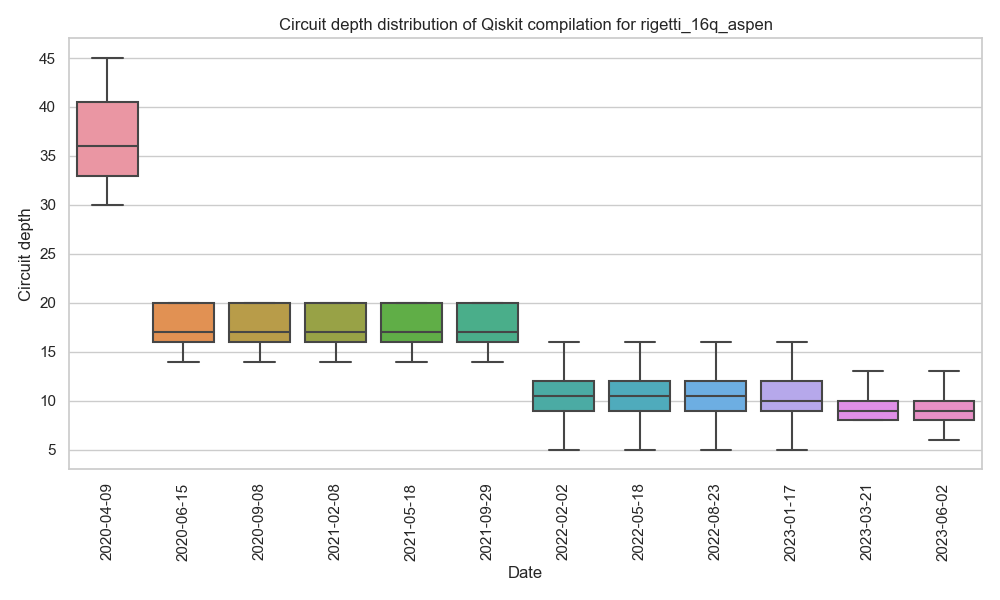
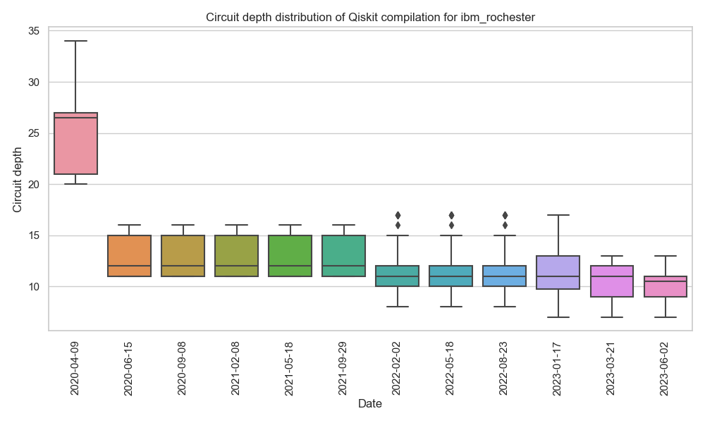
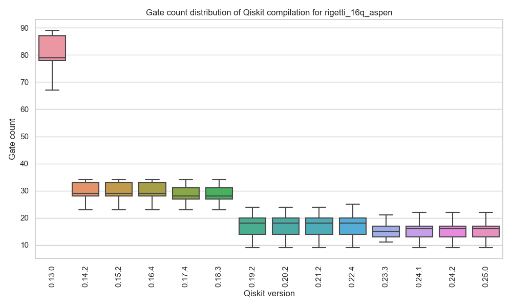
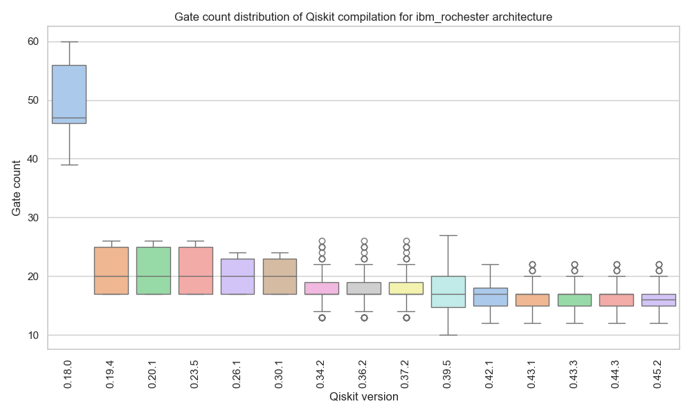

# Welcome to Qiskit Metriq

This repository contains a collection of scripts designed to execute `Qiskit` compilation experiments on quantum circuits and upload benchmark results to [metriq.info](https://metriq.info/), a community-driven platform for hosting quantum benchmarks.

At its core, `Qiskit Metriq` tracks essential metrics such as circuit depth and gate count for these experiments, automatically running jobs for every version of `Qiskit`, streamlining the process of evaluating the performance of quantum circuits compiled with `Qiskit`.

## Archictecture

This project creates a [tox](https://pypi.org/project/tox/) environment for each `Qiskit` version, starting from `qiskit-terra v0.13.0` to [latest](https://github.com/Qiskit/qiskit/releases). The `Qiskit` circuit compilation is batch processed, and the results are automatically submitted to [metriq.info](https://metriq.info/).

Benchmark tasks for quantum computer compilers:
- [ex1_226.qasm](https://github.com/CQCL/pytket/blob/2afee82a46cee18d618b7adf4b2b810a8a9da4e8/examples/benchmarking/ibmq/ex1_226.qasm) quantum circuit:
    - [Metriq Task 25](https://metriq.info/Task/25) - Parent task
    - [Metriq Task 26](https://metriq.info/Task/26) - Child task: specific to Aspen architecture
    - [Metriq Task 27](https://metriq.info/Task/27) - Child task: specific to IBMQ Rochester architecture

## Qiskit compilation results
**Circuit depth distribution**

Compiled for the Rigetti 16Q Aspen architecture


Compiled for the IBMQ Rochester architecture


**Gate count distribution**

Compiled for the Rigetti 16Q Aspen architecture


Compiled for the IBMQ Rochester architecture


## Requirements
* [tox](https://pypi.org/project/tox/)
* Python 3.8+

## Run locally
### To run a benchmark experiment using the current stable version of `Qiskit`:
```bash
tox -e qiskit-compilation
```
**Note:**
To run a specific version of `qiskit-terra`, you can manually update it in the `tox.ini` file.
Versions >=0.13,<=0.15 require numpy<1.20. You can run the tox environments `terra13`, `terra14` or `terra15` as:
```bash
tox -e qiskit-compilation-terra13
```
